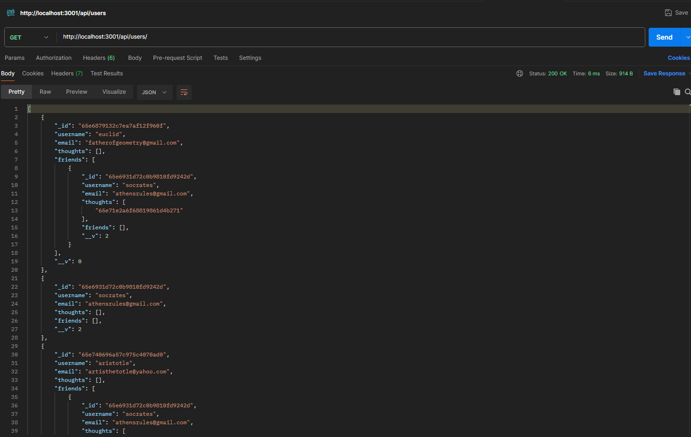

# Social Network API

## Description

This Social Network API features a finished back-end which makes use of express and mongoose. Using API CRUD functionaility, a user is able to create new users, add friends, create thoughts, and create reactions to thoughts. You are also able to modify any of them by ID or delete them as well.

## Table of Contents

- [Installation](#installation)
- [Usage](#usage)
- [Credits](#credits)
- [License](#license)
- [Questions](#questions)

## Installation

Clone the repository. Run `npm install` within the console to install the dependencies required. Once that is done, you can run `node server.js` to start the server. This app doesn't come with pre-seeded data, so you can begin by sending post requests to `http://localhost:3001/api/users`. I reccomend using either Postman or Insomnia to test all of the api routes.

## Usage

For a walkthrough video on using the app, please visit this link! 

https://drive.google.com/file/d/1hxHVn1uT-TV4UMPtu0x7QOAFL22F3bW3/view?usp=sharing

## Credits

Credit to the UofM Bootcamp for providing the initial starter code to the project

## License

This project is licensed under the MIT license. License link: https://opensource.org/license/mit/

## Questions

You can see below to reach me for any questions you have regarding the project.

https://github.com/rb2277

